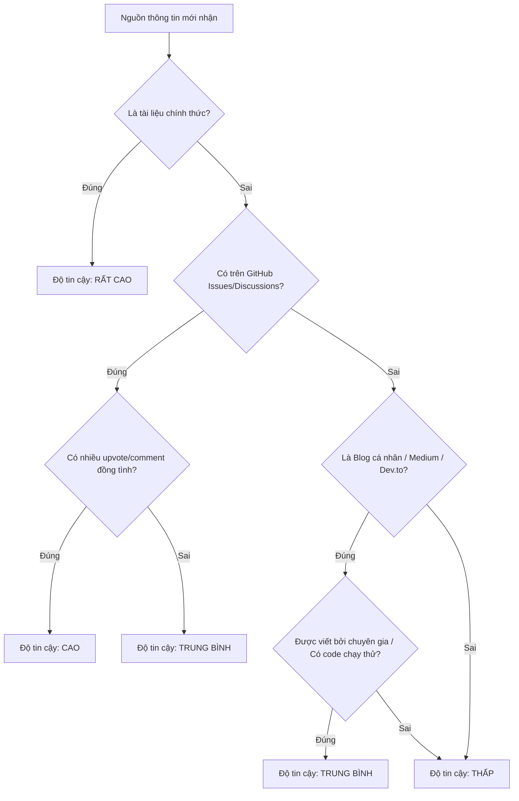

# Cẩm nang nghiên cứu Internet nâng cao (Advanced Internet Research Playbook)

Tài liệu này cung cấp các hướng dẫn chi tiết, ví dụ thực tế và các mẫu biểu mẫu để tối ưu hóa quá trình thu thập thông tin từ Internet dành cho AI Agent.

---

## 1. Mẹo tối ưu hóa câu truy vấn nâng cao (Advanced Search Query Hacks)

Việc viết câu truy vấn tốt quyết định 80% chất lượng kết quả tìm kiếm. Dưới đây là bảng tham chiếu các cấu trúc câu truy vấn nâng cao:

| Mục tiêu tìm kiếm | Mẫu câu truy vấn đề xuất | Giải thích |
| :--- | :--- | :--- |
| **Tìm lỗi thư viện cụ thể** | `"Error: <message>" site:github.com/org/repo` | Giới hạn tìm kiếm lỗi chính xác trong Issues của repository cụ thể trên GitHub. |
| **Tài liệu chính thức** | `site:<docs-domain> "how to" <feature>` | Chỉ tìm kiếm trong trang tài liệu chính thức (ví dụ: `site:nextjs.org "how to" middleware`). |
| **So sánh tính năng** | `"<library A>" vs "<library B>" (performance OR benchmark OR comparison)` | So sánh trực diện hai công nghệ với các tiêu chí cụ thể. |
| **Tìm tài liệu PDF/Slide** | `<topic> filetype:pdf site:edu` | Tìm các báo cáo nghiên cứu hoặc giáo trình đại học dạng PDF. |
| **Loại bỏ kết quả rác** | `<keyword> -site:spam-domain.com` | Loại bỏ các trang web tự động copy bài viết hoặc các trang spam quảng cáo. |

---

## 2. Quy trình đánh giá độ tin cậy của nguồn (Source Credibility Matrix)

Khi đứng trước nhiều luồng thông tin khác nhau, hãy sử dụng ma trận sau để đánh giá độ tin cậy trước khi tích hợp vào giải pháp:



### Tiêu chí kiểm tra nhanh (Quick Checklist):
1. **Thời gian**: Bài viết được xuất bản hoặc cập nhật gần đây không? (Khuyến nghị trong vòng 1-2 năm gần nhất với các framework cập nhật liên tục).
2. **Minh chứng**: Có mã nguồn chạy thử (executable code) đi kèm không?
3. **Phản hồi**: Phần bình luận hoặc thảo luận bên dưới đánh giá thế nào? Có ai báo lỗi khi chạy theo hướng dẫn không?

---

## 3. Quy trình xác minh chéo & Phát hiện mâu thuẫn (Cross-Referencing Workflow)

Khi gặp các thông tin trái chiều hoặc mâu thuẫn giữa các nguồn:

1. **Bước 1: Liệt kê các quan điểm**: Ghi nhận rõ ràng giải pháp của Nguồn A và Nguồn B.
2. **Bước 2: Phân tích ngữ cảnh**:
   - Nguồn A dùng phiên bản nào? Nguồn B dùng phiên bản nào? (Sự khác biệt phiên bản là nguyên nhân của 90% mâu thuẫn trong lập trình).
   - Môi trường chạy của từng nguồn là gì? (Ví dụ: Server-side vs Client-side, Node.js vs Browser).
3. **Bước 3: Thực hiện đối chiếu thực nghiệm**:
   - Nếu có thể, hãy kiểm tra tính đúng đắn bằng cách đối chiếu với mã nguồn hiện tại trong workspace.
   - Ưu tiên giải pháp tuân thủ các tiêu chuẩn bảo mật hiện đại và có hiệu năng tốt hơn.

---

## 4. Mẫu báo cáo nghiên cứu tiêu chuẩn (Standard Research Report Template)

Khi hoàn thành quá trình nghiên cứu, hãy tổng hợp kết quả theo cấu trúc sau để trình bày cho người dùng hoặc sử dụng làm tài liệu tham khảo:

```markdown
# Báo cáo Nghiên cứu: [Tên chủ đề/Lỗi cần giải quyết]

## 1. Tóm tắt kết quả (Executive Summary)
- **Vấn đề cốt lõi**: [Mô tả ngắn gọn]
- **Giải pháp đề xuất**: [Giải pháp tối ưu nhất được chọn]
- **Độ tin cậy**: [Cao / Trung bình / Thấp] (dựa trên nguồn gốc thông tin)

## 2. Chi tiết giải pháp (Technical Solution)
- **Cơ chế hoạt động**: [Giải thích ngắn gọn cách hoạt động]
- **Mã nguồn ví dụ (Code Snippet)**:
  ```[language]
  // Code ví dụ đã được tối ưu hóa
  ```

## 3. Đối chiếu các nguồn thảo luận (Cross-Referencing & Analysis)
| Nguồn | Giải pháp đưa ra | Ưu điểm | Nhược điểm |
| :--- | :--- | :--- | :--- |
| [Nguồn 1](URL) | [Mô tả ngắn] | - Ưu 1 | - Nhược 1 |
| [Nguồn 2](URL) | [Mô tả ngắn] | - Ưu 1 | - Nhược 1 |

## 4. Khuyến nghị & Bước tiếp theo (Recommendations)
- [ ] [Hành động 1]
- [ ] [Hành động 2]
```
